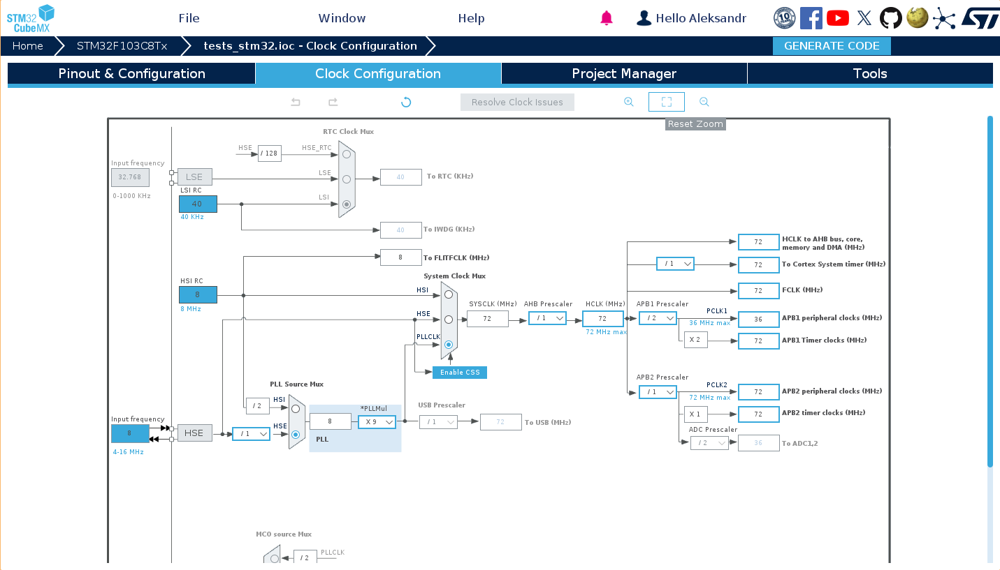
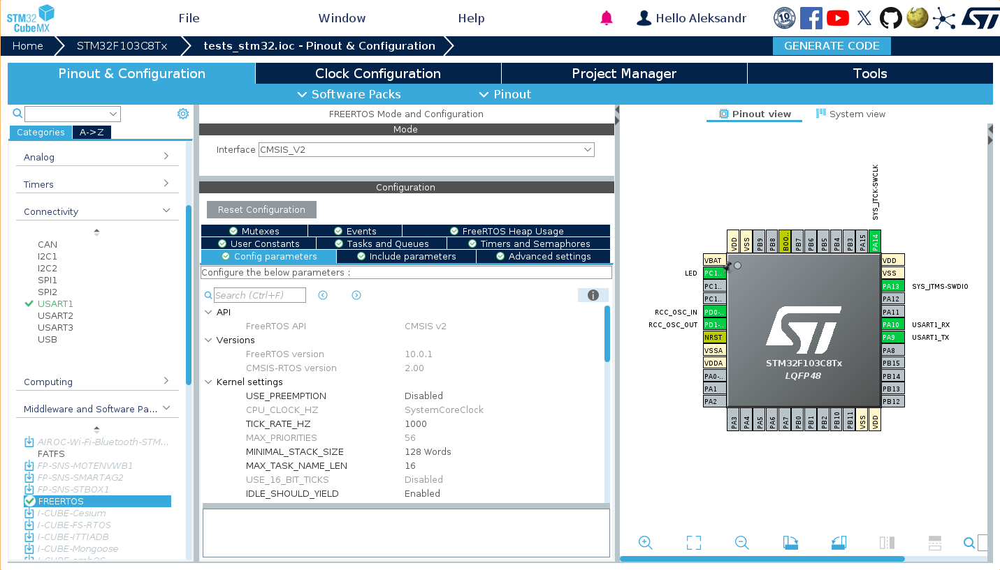
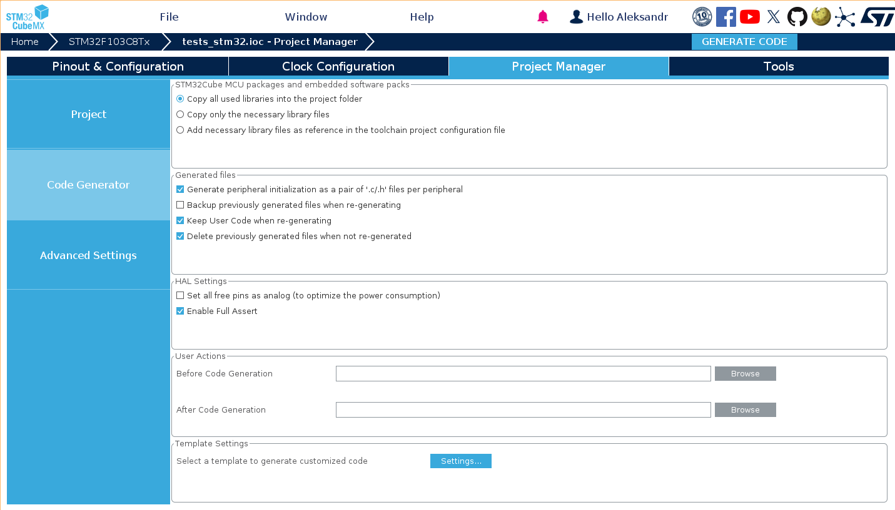
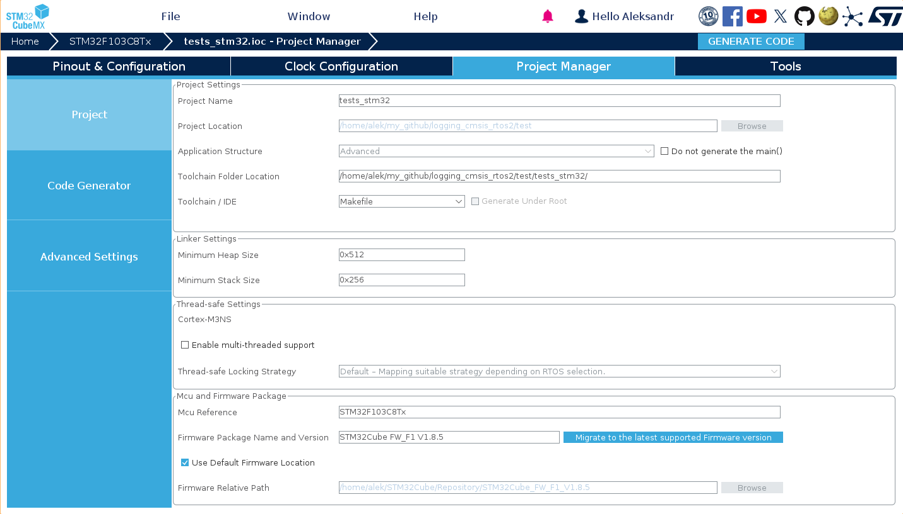
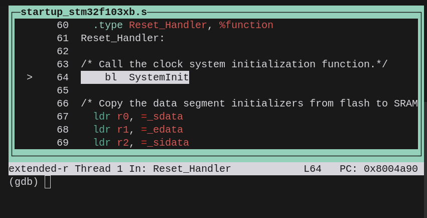
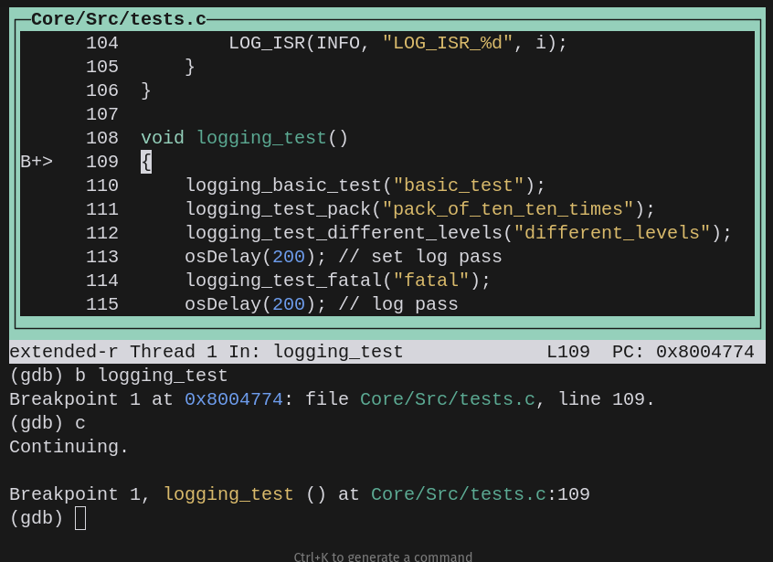
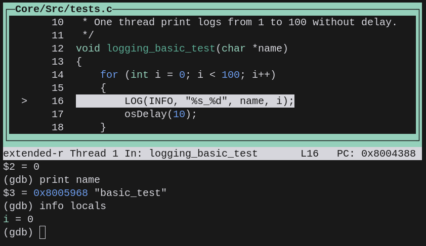
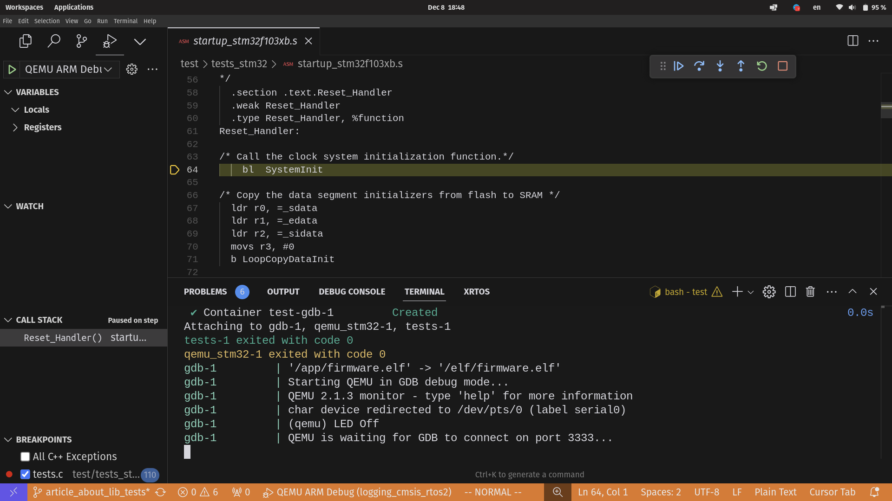
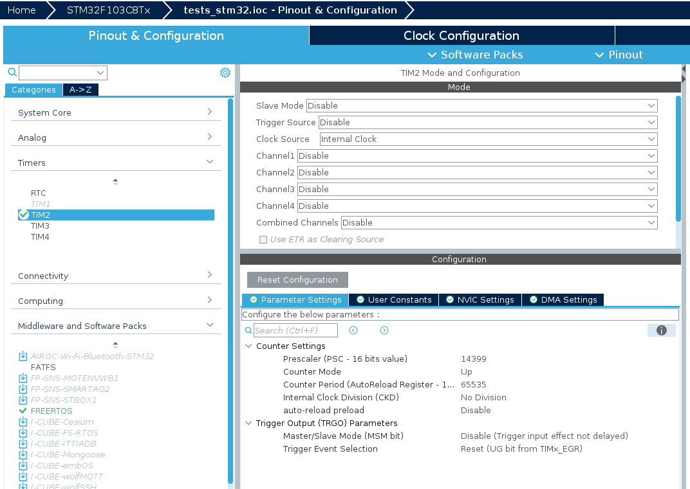
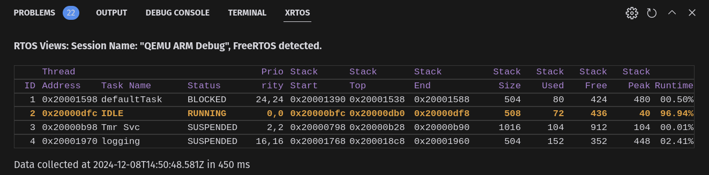

# Тестирование и отладка встраиваемых систем STM32 с использованием QEMU эмулятора и Docker

## Рекомендации

Статья будет полезна разработчикам встраиваемых систем, которые хотят автоматизировать процесс тестирования своих проектов. Отдельный блок посвещен отладке `gdb` в эмуляторе QEMU. В качестве примера используется библиотека логирования ([GitHub](https://github.com/AleksandrVin/logging_cmsis_rtos2), [Habr](https://habr.com/ru/articles/814745/)), но описанный подход применим к любым проектам на базе STM32.

## Введение

При разработке встраиваемых систем тестирование часто становится узким местом процесса разработки. Основные проблемы включают:

- **Зависимость от железа:** Необходимость иметь физическое устройство для каждого разработчика и CI-сервера
- **Сложность автоматизации:** Подключение реальных устройств к CI-системам требует дополнительного оборудования и настройки
- **Воспроизводимость тестов:** Тесты на реальном оборудовании могут давать различные результаты из-за временных характеристик и состояния устройства

В этой статье рассмотрим подход к решению этих проблем с помощью эмулятора QEMU и контейнеризации через Docker. В качестве примера возьмем библиотеку логирования для STM32, но описанные методы применимы к любым проектам на базе этого микроконтроллера. Особенно это актуально для удаленной разработки.

В описываемом подходе используются открытые инструменты и технологии, что позволяет легко адаптировать под конкретные нужды и использовать в коммерческих проектах.

### Что вы узнаете из статьи

1. [Как настроить систему сборки и эмуляции](#система-сборки-в-docker-и-эмулятор-qemu) с использованием Docker и QEMU
2. [Как подготовить тестовый проект](#тестовый-проект) на базе STM32CubeMX
3. [Как автоматизировать тестирование](#автоматическое-тестирование) STM32 проектов
4. [Как отлаживать приложение](#отладка-с-использованием-gdb-и-qemu) в эмуляторе

## Система сборки в Docker и эмулятор QEMU

### Почему Docker?

При разработке встраиваемых систем мы часто сталкиваемся с проблемой "у меня работает". Это происходит из-за различий в:

- Версиях компилятора
- Установленных библиотеках
- Настройках окружения

Docker решает эти проблемы, предоставляя изолированную среду с точно определенными версиями всех компонентов.

### Структура Docker-контейнеров

Для создания полноценной среды разработки используется три контейнера:

1. **Контейнер для кросс-компиляции** ([Dockerfile.tests](https://github.com/AleksandrVin/logging_cmsis_rtos2/blob/main/test/Dockerfile.tests))
   - Содержит ARM GCC toolchain, загруженный напрямую с developer.arm.com
   - Обеспечивает доступ к последней версии arm-none-eabi-gcc
   - Включает make и другие инструменты сборки

2. **Контейнер с QEMU** ([Dockerfile.qemu_stm32](https://github.com/AleksandrVin/logging_cmsis_rtos2/blob/main/test/Dockerfile.qemu_stm32))
   - Собирает QEMU из исходного кода [beckus/qemu_stm32](https://github.com/beckus/qemu_stm32)
   - Компиляция QEMU происходит только при первой сборке контейнера
   - Эмулирует периферию микроконтроллера

    > ⚠️ **Важно:** Используемая версия QEMU является устаревшей и поддерживает только старые модели STM32. Существует потребность в обновлении эмулятора для поддержки современных микроконтроллеров STM32. Это может быть интересным проектом для сообщества разработчиков.

3. **Контейнер для запуска тестов** ([Dockerfile.run_tests](https://github.com/AleksandrVin/logging_cmsis_rtos2/blob/main/test/Dockerfile.run_tests))
   - Объединяет результаты работы предыдущих контейнеров
   - Запускает тесты и собирает результаты
   - Генерирует отчеты о тестировании

### QEMU для STM32

QEMU - это мощный эмулятор, способный эмулировать различные архитектуры процессоров. Для работы с STM32 используется специальная версия QEMU с поддержкой периферии STM32.

#### Поддерживаемая периферия

На момент написания статьи для STM32F103C8 поддерживаются:

- UART
- Таймеры
- GPIO
- Прерывания
- Базовые системные функции

> 💡 **Совет:** Несмотря на ограничения текущей версии QEMU, этот подход к тестированию может быть адаптирован под другие эмуляторы или более новые версии QEMU по мере их появления.

## Тестовый проект

### Генерация проекта в STM32CubeMX

Проект создан с помощью STM32CubeMX, что обеспечивает корректную начальную конфигурацию микроконтроллера и периферии.



Ключевые настройки проекта:

- Тактирование: HSE 8 МГц с PLL до 72 МГц
- UART1 для вывода логов
- GPIO PC13 для LED-индикации
- Системные таймеры для FreeRTOS


> Конфигурация FreeRTOS с использованием CMSIS-RTOS2 API

При генерации кода важно выбрать правильные параметры:


> Копирование библиотек в проект. Использование .c и .h файлов для периферии.


> Выбор Makefile в качестве системы сборки для интеграции с Docker. Увеличение размера кучи, так как используется динамическая память во FreeRTOS. При тестировании создается 10 потоков.

### Структура проекта

Проект использует стандартную структуру STM32CubeMX, которая находится в директории `tests_stm32`. Скрипты для сборки и тестирования находятся в директории `test`. Тестируемая библиотека находится в директории `lib` и копируется в проект при сборке.

```tree
├── lib
│   ├── logging.c
│   ├── logging.h
│   ├── logging_usb.c
│   └── logging_usb.h
├── LICENSE
├── README.md
└── test
    ├── compose.yaml
    ├── Dockerfile.qemu_stm32
    ├── Dockerfile.run_tests
    ├── Dockerfile.tests
    ├── start_qemu_gdb_mode.sh
    ├── test_in_docker.sh
    ├── test.sh
    ├── tests_stm32
    │   ├── Core
    │   ├── Drivers
    │   ├── logging_cmsis_rtos2
    │   ├── Makefile
    │   ├── Middlewares
    │   ├── startup_stm32f103xb.s
    │   ├── STM32F103C8Tx_FLASH.ld
    │   └── tests_stm32.ioc
    └── verify_output.py
```

При сборке, `test.sh` копирует библиотеку логирования в тестовый проект и запускает сборку. В `Makefile` добавлены дополнительные флаги для сборки библиотеки и тестов.

### FreeRTOS интеграция

FreeRTOS настраивается через STM32CubeMX со следующими параметрами:

- Включен DefaultTask
- Используется динамическое выделение памяти
- Увеличен размер heap для поддержки многопоточного теста, в котором создается 10 дополнительных потоков. При стандартной конфигурации FreeRTOS хватает памяти только на создание 2 потоков
- Активированы функции трассировки (подробнее в разделе отладки)

Весь пользовательский код FreeRTOS размещается в `freertos.c`:

```c:test/tests_stm32/Core/Src/freertos.c
// Определение основного потока
osThreadId_t defaultTaskHandle;
const osThreadAttr_t defaultTask_attributes = {
  .name = "defaultTask",
  .stack_size = 128 * 4,
  .priority = (osPriority_t) osPriorityNormal,
};

// Точка входа для тестов
void StartDefaultTask(void *argument)
{
  logging_init();
  // Задержка для подключения терминала
  osDelay(1000);
  // Запуск тестов
  logging_test();
  // ...
}
```

Этот поток используется как точка входа для запуска тестов и инициализации библиотеки логирования.

> 💡 **Совет:** STM32CubeMX позволяет легко модифицировать конфигурацию проекта через графический интерфейс с последующей регенерацией кода. Однако, это и в некотором смысле обязавает разработчика всегда изменять конфигурацию через cubemx, дабы не нарушить структуру проекта, что скажется на читаемости кода и возможностях доработки.

## Тестирование библиотеки логирования

Тесты реализованы в [`tests.c`](https://github.com/AleksandrVin/logging_cmsis_rtos2/blob/main/test/tests_stm32/Core/Src/tests.c) и проверяют различные режимы работы библиотеки логирования:

```c:test/tests_stm32/Core/Src/tests.c
void logging_test()
{
    logging_basic_test("basic_test");                  // Базовые тесты
    osDelay(200);                                      // Ожидание вывода логов
    logging_test_pack("pack_of_ten_ten_times");       // Пакетная запись
    osDelay(200);                                      // Ожидание вывода логов
    logging_test_different_levels("different_levels"); // Разные уровни логов
    osDelay(200);                                      // Ожидание вывода логов
    logging_test_fatal("fatal");                      // Фатальные ошибки
    osDelay(200);                                      // Ожидание вывода логов
    logging_interrupt();                              // Логи из прерываний
    osDelay(200);                                      // Ожидание вывода логов
    logging_test_multiple_threads();                  // Многопоточный тест
}
```

> 💡 **Примечание:** Задержки между тестами (`osDelay`) позволяют потоку логирования опустошить буферы и четко разделить вывод разных тестовых сценариев.

### Ключевые тестовые сценарии

1. **Базовое тестирование**

    ```text
    [INFO     ][1s.1]: basic_test_0
    [INFO     ][1s.12]: basic_test_1
    [INFO     ][1s.22]: basic_test_2
    ```

    - Проверка форматирования сообщений
    - Временные метки с миллисекундной точностью
    - Последовательная запись логов

    Библиотека логирования использует тики ядра FreeRTOS для получения времени. Время фиксириуется при вызове функции логирования и хранится в буфере до передачи через интерфейс, те отражает время возникновения события, а не передачи через интерфейс.

2. **Уровни логирования**

    ```text
    [DEBUG_ALL][2s.112]: different_levels_DEBUG_ALL
    [DEBUG_MIN][2s.112]: different_levels_DEBUG_MIN
    [INFO     ][2s.112]: different_levels_INFO
    [WARNING  ][2s.112]: different_levels_WARNING
    [ERROR    ][2s.112]: different_levels_ERR
    ```

3. **Специальные режимы**

    ```text
    # Фатальные ошибки (прямой вывод в UART)
    fatal_0
    fatal_1

    # Логи из прерываний (без буферизации)
    [INFO     ][2s.512]ISR: LOG_ISR_9
    ```

    - `LOG_FATAL` - прямая запись в UART, без буферизации
    - `LOG_ISR` - логирование из прерываний, без использования буфера

    ```c:test/tests_stm32/Core/Src/tests.c
    void logging_interrupt()
    {
        // только последний лог будет напечатан
        for (int i = 0; i < LOGS_AT_ONCE; i++) {
            LOG_ISR(INFO, "LOG_ISR_%d", i);
        }
    }
    ```

    > ⚠️ **Важно про ISR:** В выводе видно только последнее сообщение (`LOG_ISR_9`), и это ожидаемое поведение. В контексте прерывания:
    > - Нельзя использовать блокирующие операции
    > - Буферизация не применяется
    > - Поток логирования имеет более низкий приоритет
    > В результате, пока поток логирования обрабатывает одно сообщение, следующий вызов `LOG_ISR` уже перезаписывает данные. Это компромисс между безопасностью работы в ISR и гарантией доставки всех сообщений.

4. **Многопоточный тест**

    ```c
    void logging_test_multiple_threads()
    {
        for (int i = 0; i < THREADS_AMOUNT; i++) {
            threads[i] = osThreadNew(logging_thread, names[i], NULL);
        }
    }
    ```

    ```text
    [INFO     ][2s.812]: logging_thread_4_0
    [INFO     ][2s.812]: logging_thread_4_1
    [INFO     ][2s.812]: logging_thread_5_1
    [INFO     ][2s.812]: logging_thread_6_1
    ```

    - 10 потоков одновременно пишут логи
    - Тестирует циклический буфер под нагрузкой
    - Поток логирования имеет нормальный приоритет
    - Тестовые потоки блокируются при заполнении буфера

    > 💡 **Особенность:** Библиотека использует отложенный вывод логов через UART. При малом количестве логов они выводятся в фоновом режиме. При переполнении буфера потоки блокируются до освобождения места. Режимы `LOG_FATAL` и `LOG_ISR` обеспечивают мгновенный вывод.

### Верификация вывода

Корректность проверяется скриптом [`verify_output.py`](https://github.com/AleksandrVin/logging_cmsis_rtos2/blob/main/test/verify_output.py). QEMU создает виртуальный терминал, в который эмулируемая STM32 выводит данные. Скрипт на Python подключается к этому терминалу и проверяет корректность вывода.

```python
# Пример проверки формата INFO сообщения
pattern = r"\[INFO\s*\]\[(\d+)s\.(\d+)\]: basic_test_(\d+)"
match = re.match(pattern, output)
if match:
    seconds = int(match.group(1))
    milliseconds = int(match.group(2))
    test_number = int(match.group(3))
```

Скрипт завершается успешно, если все сообщения корректны. Данный участок кода необходимо дорабатывать в зависимости от требований тестируемого проекта. Например, в случае зависания проекта или отсутствия полного набора сообщений, скрипт будет ожидать бесконечно. Это можно исправить, добавив таймауты и более сложную логику, которая при обнаружении таких ситуаций будет запускать внутренний механизм "выключения" QEMU, например, при возникновении HardFault или аналогичных ошибок.

## Автоматическое тестирование

После реализации тестовых сценариев следующим шагом является автоматизация их выполнения. Для этого используется комбинация Docker и GitHub Actions.

### Docker-контейнеризация

Тестирование выполняется в тех же трех контейнерах, описанных ранее:

```yaml
services:
  tests:
    build:
      context: .
      dockerfile: Dockerfile.tests
    image: tests
  
  qemu_stm32:
    build:
      context: .
      dockerfile: Dockerfile.qemu_stm32
    depends_on:
      - tests
    image: qemu_stm32

  run_tests: &run_tests
    build:
      context: .
      dockerfile: Dockerfile.run_tests
    depends_on:
      - qemu_stm32
      - tests
    volumes:
      - ./logs/:/test/logs
      - ./elf/:/elf
    profiles:
      - test
    image: run_tests
```

Каждый контейнер выполняет свою роль в процессе тестирования:

1. `tests` — компилирует прошивку с тестами.
2. `qemu_stm32` — предоставляет среду эмуляции.
3. `run_tests` — запускает тесты и верифицирует результаты.

### Запуск тестов

Автоматизация запуска реализована через скрипт `test.sh`:

```shell
#!/bin/bash
# Копирование библиотеки в тестовый проект
cp -r ../lib/ tests_stm32/logging_cmsis_rtos2

# Запуск контейнеров
docker compose --profile test up --build

# Сохранение логов
docker compose logs $container > $logs_file

# Получение кода завершения
exit_code=$(docker inspect -f '{{.State.ExitCode}}' $test_container_name)
```

> 💡 **Особенность:** Скрипт не только запускает тесты, но и обеспечивает корректное копирование библиотеки и сохранение результатов тестирования.

#### Интеграция с CI/CD

Тесты автоматически запускаются при каждом push и pull request через GitHub Actions:

```yaml:.github/workflows/test.yml
name: CI
on: 
    push:
    pull_request:

jobs:
  test:
    runs-on: ubuntu-latest
    steps:
    - uses: actions/checkout@v4
    - name: Run test
      run: cd test && ./test.sh
    - name: Archive test results
      uses: actions/upload-artifact@v4
      with:
        name: combined_logs
        path: |
          ./test/logs/logs.txt
          ./test/logs/serial_output.txt
```

> 💡 **Совет:** Для корпоративного использования можно настроить self-hosted runner на собственном сервере сборки. Подход совместим с GitLab CI и другими CI-системами. В данном случае используется GitHub Actions, который предоставляется бесплатно для open-source проектов.

### Анализ результатов

Тесты генерируют два файла с результатами:

1. `logs.txt` — отладочный вывод процесса тестирования
2. `serial_output.txt` — логи от тестируемой библиотеки

Эти файлы сохраняются как артефакты сборки и могут быть использованы для:

- Анализа причин неудач тестов
- Проверки корректности работы библиотеки
- Документирования поведения системы

## Отладка с использованием GDB и QEMU

Отладка встраиваемых систем часто напоминает детективное расследование. К счастью, QEMU и GDB предоставляют полный набор инструментов для этого.

### Как это работает?

QEMU, как истинный проект GNU, поддерживает все стандартные инструменты отладки. Для тестов мы просто указываем имя последовательного интерфейса:

```shell:test/test_in_docker.sh
QEMU_FLAGS=(
    "-nographic"
    "-M" "stm32-f103c8"
    "-kernel" "/app/firmware.bin"
    "-serial" "pty"
)
```

> 💡 **Для любопытных:** Соответствие между USART'ами STM32 и PTY в QEMU определяется в исходном коде эмулятора. Если требуется что-то особенное, придется изучать исходники. RTSL — Read The Source, Luke!

### Режим отладки

Скрипт `test_in_docker.sh` поддерживает два режима работы:

1. **Тестовый режим** — обычный запуск тестов
2. **Режим отладки** — запуск с поддержкой GDB:

```shell:test/test_in_docker.sh
if [ "$1" == "gdb" ]; then
    QEMU_FLAGS+=(
        "-gdb" "tcp::3333"  # GDB-сервер на порту 3333
        "-S"                # Остановка при старте
    )
    echo "Starting QEMU in GDB debug mode..."
fi
```

### Подключение отладчика

Для подключения к QEMU используется `arm-none-eabi-gdb`. В тестовом проекте есть готовая цель:

```makefile:tests_stm32/Makefile
gdb: 
    arm-none-eabi-gdb ../elf/firmware.elf -ex "target extended-remote :3333"
```

> ⚠️ **Важно:** Здесь есть небольшая магия! Прошивка для GDB берется из Docker-контейнера через volume:
>
> ```yaml:test/compose.yaml
> volumes:
>   - ./elf/:/elf    # Файлы для GDB
> ```

### Запуск отладки (GDB)

Для запуска QEMU в режиме отладки используется специальный скрипт:

```shell:test/start_qemu_gdb_mode.sh
#!/bin/bash
docker compose --profile gdb up --build
```

Он использует профиль `gdb` в Docker Compose:

```yaml:test/compose.yaml
gdb:
  <<: *run_tests           # Наследуем настройки от run_tests
  ports:
    - "3333:3333"         # Открываем порт для GDB
  profiles:
    - gdb                 # Отдельный профиль
  entrypoint: ["./test_in_docker.sh", "gdb"]
```

> 💡 **Профили в Docker Compose** позволяют иметь различные конфигурации в одном файле. Профиль `test` предназначен для тестов, а `gdb` — для отладки. Это позволяет выбирать, какую конфигурацию запускать в зависимости от текущих потребностей.

#### Процесс отладки

1. **Запуск QEMU в режиме отладки:**

   ```bash
   ./start_qemu_gdb_mode.sh
   ```

2. **Подключение к GDB в другом терминале:**

   ```bash
   cd tests_stm32 && make gdb
   ```

3. **Ожидание подключения GDB:**
   QEMU ожидает подключения и удерживает прошивку в состоянии паузы, что позволяет:
   - Устанавливать точки останова
   - Изучать начальное состояние системы
   - Отлаживать инициализацию системы

#### Практика работы с GDB

После запуска отладки вы увидите несколько терминалов:

1. **Терминал QEMU:**
   В терминале, где был запущен скрипт `start_qemu_gdb_mode.sh`, будет отображено сообщение о том, что QEMU ожидает подключения:

   

2. **Терминал GDB:**

   ```sh
   test/tests_stm32$ make gdb
   arm-none-eabi-gdb ../elf/firmware.elf -ex "target extended-remote :3333"
   GNU gdb (Arm GNU Toolchain 12.2.MPACBTI-Rel1 (Build arm-12-mpacbti.34)) 13.1.90.20230307-git
   Copyright (C) 2023 Free Software Foundation, Inc.
   License GPLv3+: GNU GPL version 3 or later <http://gnu.org/licenses/gpl.html>
   This is free software: you are free to change and redistribute it.
   There is NO WARRANTY, to the extent permitted by law.
   Type "show copying" and "show warranty" for details.
   This GDB was configured as "--host=x86_64-pc-linux-gnu --target=arm-none-eabi".
   Type "show configuration" for configuration details.
   For bug reporting instructions, please see:
   <https://bugs.linaro.org/>.
   --Type <RET> for more, q to quit, c to continue without paging--
   ```

3. **GDB в режиме TUI (Text User Interface):**

   Включение режима TUI позволяет визуализировать процесс отладки:

   ```bash
   # Включить TUI режим
   (gdb) tui enable
   ```

   

#### Основные команды отладки

1. **Установка точки останова:**

   Поставим брейкпоинт в функцию, запускающую тесты:

   ```gdb
   (gdb) break logging_test
   ```

2. **Запуск программы:**

   Разрешим выполнение программы. Исполнение остановится при достижении установленного брейкпоинта:

   ```gdb
   (gdb) continue
   ```
  
   

3. **Пошаговое выполнение:**
  
   Позволяет выполнять программу построчно или заходить внутрь функций:
  
   ```gdb
   (gdb) next    # Выполнить строку (n)
   (gdb) step    # Зайти внутрь функции (s)
   ```

4. **Просмотр переменных:**
  
   Для просмотра значения переменной используйте:
  
   ```gdb
   (gdb) print name     # Вывести значение переменной
   (gdb) info locals    # Вывести все локальные переменные
   ```
  
   
  
   > 💡 **Совет:** GDB поддерживает сокращения для часто используемых команд:
   > - `c` = continue
   > - `n` = next
   > - `s` = step
   > - `p` = print
   > - `bt` = backtrace (стек вызовов)

### Типичные проблемы

1. **Оптимизация компилятора** может "спрятать" переменные:

   ```gdb
   (gdb) print i
   No symbol "i" in current context.
   ```
  
   **Решение:** Используйте флаги `-O0` вместе с `-g` (отладочные символы) при компиляции для отладки. В Makefile эти опции уже установлены.

2. **Потеря контекста при прерываниях:**
  
   ```gdb
   (gdb) where
   #0 HardFault_Handler () at ../Core/Src/stm32f1xx_it.c:89
   #1 <signal handler called>
   #2 ?? () at ??:?
   ```
  
   **Решение:** Установите брейкпоинт в обработчике прерывания.

> ⚠️ **Важно:** Отладка встраиваемых систем — это искусство. GDB может показаться сложным, но это мощный инструмент, особенно в сочетании с интегрированными средами разработки (IDE).

### Отладка в VS Code

Visual Studio Code предоставляет графический интерфейс для GDB, значительно упрощающий процесс отладки. Это альтернатива командной строке `make gdb`, где под капотом используется тот же протокол GDB для подключения к серверу отладки, но вместо CLI предлагается удобный графический интерфейс.

#### Настройка VS Code

Для работы с QEMU и GDB необходима специальная конфигурация в файле `launch.json`. VS Code может сгенерировать базовый шаблон этого файла (F1 -> "Debug: Add Configuration"), но его нужно адаптировать под наш проект:

```json:.vscode/launch.json
{
    "configurations": [
        {
            "name": "QEMU ARM Debug",
            "type": "cppdbg",
            "request": "launch",
            "program": "${workspaceFolder}/test/elf/firmware.elf",
            "miDebuggerServerAddress": "localhost:3333",
            "cwd": "${workspaceFolder}/test/tests_stm32",
            "targetArchitecture": "arm",
            "MIMode": "gdb",
            "stopAtEntry": true
        }
    ]
}
```

#### Процесс отладки в VS Code

1. **Запустите QEMU в режиме отладки:**
  
   ```bash
   ./start_qemu_gdb_mode.sh
   ```

2. **Откройте VS Code и перейдите в режим отладки (F5 или Ctrl+Shift+D).** Если QEMU запущен, VS Code автоматически подключится к нему и откроет файлы проекта, на которые указывает регистр "PC". Убедитесь, что установлено расширение C/C++ для VS Code, позволяющее просматривать переменные и управлять стеком вызовов.

    

3. **Установите точки останова, кликнув слева от номера строки.** Появится индикатор красной точки.

    

4. **Нажмите кнопку "Start Debugging" (F5):**
  
   Исполнение программы прервется при достижении брейкпоинта. Далее вы можете использовать все команды GDB через графический интерфейс VS Code.
  
   > 💡 **Преимущества VS Code:**
   > - Визуальное управление точками останова
   > - Просмотр переменных в реальном времени
   > - Навигация по коду во время отладки
   > - Встроенный терминал для параллельной работы с QEMU
   > - Удобство работы с переменными и стеком вызовов
   > - Поддержка многопоточности
   >
   > **Примечание:** Хотя VS Code предоставляет удобный интерфейс, знание базовых команд GDB остаётся полезным для отладки на медленных машинах, где частые запросы к серверу GDB по сети могут существенно замедлить процесс. Это также ключевой навык при автоматизации процесса тестирования и понимании инструментов GNU GCC.

### Профилирование FreeRTOS в VS Code

Одной из самых мощных возможностей при отладке является визуализация работы RTOS. Настроим инструменты, позволяющие "заглянуть внутрь" операционной системы и установить связь с нашим устройством, чтобы понимать, где оно тратит время и память.

> 💡 **Примечание:** Подробнее о возможностях профилирования можно прочитать в [официальной документации FreeRTOS](https://www.freertos.org/Documentation/02-Kernel/02-Kernel-features/08-Run-time-statistics).

#### Включение статистики FreeRTOS

1. **В STM32CubeMX включите необходимые опции для RTOS на основной странице:**
  
   
  
   > 💡 **Важно:** Не забудьте включить `RECORD_STACK_HIGH_ADDRESS` для отслеживания использования стека каждым потоком.

#### Настройка таймера для профилирования

Для измерения времени выполнения потоков необходим таймер. Настроим TIM2 так, чтобы он работал чуть быстрее системного таймера, но достаточно медленно, чтобы дать около 5 секунд до переполнения:



**Реализация функций для работы со статистикой:**

Добавим их в конец файла `tim.c`:

```c:test/tests_stm32/Core/Src/tim.c
unsigned long getRunTimeCounterValue(void) {
    return __HAL_TIM_GET_COUNTER(&htim2);
}

void configureTimerForRunTimeStats(void)
{
    // Таймер уже настроен HAL, просто запускаем
    HAL_TIM_Base_Start(&htim2);
}
```

> 💡 **Примечание:** Эти функции объявлены как `weak` в CMSIS-RTOS2. Мы предоставляем собственную реализацию в соответствии с нашей конфигурацией таймера.

#### RTOS Views в VS Code

1. **Установите расширение [RTOS Views](https://marketplace.visualstudio.com/items?itemName=mcu-debug.rtos-views).**
2. **Запустите отладку, как описано ранее.**
3. **Дайте системе поработать несколько секунд (чтобы успели создаться потоки).**
4. **Откройте вкладку RTOS рядом с терминалом:**

   

В таблице вы увидите:

- Список всех потоков
- Состояние каждого потока (активный/заблокированный/приостановленный)
- Использование стека
- Процент времени CPU, затраченного на каждый поток

> ⚠️ **Личный опыт:** Честно говоря, я потратил немало времени, пытаясь настроить это всё на реальном железе, когда только начинал свой путь в open-source разработке STM32. Но оно того стоило - теперь у меня есть полное понимание работы системы в любой момент отладки.

## Заключение

Эта статья - компиляция моего опыта как разработчика встраиваемых систем. Раньше моя работа в основном заключалась во взаимодействии с железом: осциллограф, паяльник и бесконечные прошивки отладочных плат. Но со временем я понял, что ключ к комфортной разработке - это правильно настроенное окружение.

> 💡 **Главный урок:** Когда ваш редактор быстр, отладка запускается одной кнопкой, а процесс идентичен что для виртуального, что для реального железа - разработка превращается в удовольствие!

В современном мире, где удаленная работа становится нормой, возможность эмуляции железа открывает новые горизонты.

### Что дальше?

Надеюсь, это небольшое введение в мир open-source инструментов, эмуляции, автоматизации и отладки на примере STM32 и моей библиотеки логирования было полезным. Весь код доступен под MIT лицензией - не стесняйтесь использовать его в своих проектах и создавать форки! ([GitHub](https://github.com/AleksandrVin/logging_cmsis_rtos2))

> ⚠️ **Напоследок:** Не бойтесь экспериментировать и создавать свои скрипты для комфортной разработки!
